# StarShield Lite

**Personal space domain awareness console** · **[v0.2.0](CHANGELOG.md)**

[](CHANGELOG.md)
[](https://github.com/Sudo-Stein/starshield-lite/actions/workflows/ci.yml)
[](https://www.python.org/downloads/)
[](https://fastapi.tiangolo.com/)
[](https://docs.docker.com/compose/)
[](#license)

StarShield Lite helps you answer practical questions about satellites from the ground:

- **What is this object?** (search public catalogs by name or NORAD ID)
- **Will I see it tonight?** (predict passes and score how good they are)
- **Where is it in my sky?** (interactive starmap + ground track)
- **What else gets close?** (conjunction watchlists, optional debris)

It ships with a web API, Streamlit dashboard, terminal UI, CLI, Docker setup, and a guided demo—so you can try it in minutes or dig into the full stack.

> *Any object → will I see it, where in my sky, what else gets close, and tell me when it matters.*

Default observer: **Kingsland, GA** (30.8°N, 81.65°W) — switchable to other profiles or custom coordinates.

---

## Quick Start

**Docker is the recommended way to try the project.** Use local Python if you want the guided CLI demo or to develop.

### Path 1 — Docker (recommended)

```bash
git clone https://github.com/Sudo-Stein/starshield-lite.git
cd starshield-lite

# Recommended for ports, webhooks, and API keys (all optional — defaults work)
cp .env.example .env

docker compose --profile full up --build
```

| Link | What it is |
|------|------------|
| http://localhost:8501 | **Streamlit dashboard** (main visual demo) |
| http://localhost:8000/docs | **API docs** (interactive OpenAPI) |
| http://localhost:8000/health | Health check |

**In the dashboard (~2 minutes):** Passes → `ISS` → Predict → click a grade button → **Starmap** (scrubber / Play). Optional: Watchlist → `iss-starlink`.

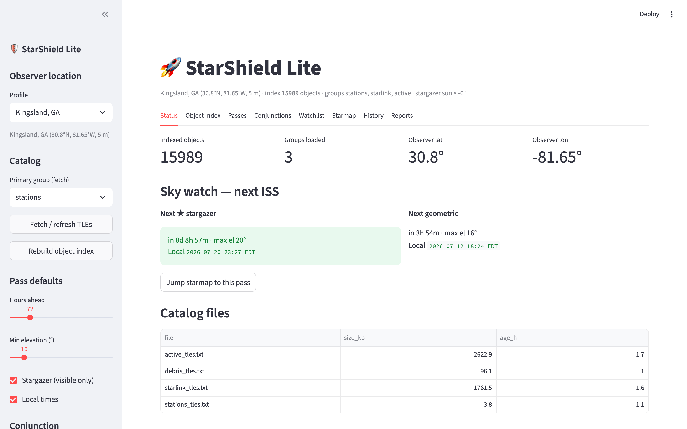

If the index is empty:

```bash
docker compose exec api python main.py fetch --group stations
docker compose exec api python main.py fetch --group starlink
```

Stop: `docker compose --profile full down` · API-only: `docker compose up --build`  
Details: [docs/DOCKER.md](docs/DOCKER.md)

---

### Path 2 — Local Python + guided demo

Requires **Python 3.9+** (3.11+ recommended).

```bash
git clone https://github.com/Sudo-Stein/starshield-lite.git
cd starshield-lite
python -m venv .venv && source .venv/bin/activate   # Windows: .venv\Scripts\activate
pip install -e ".[pdf,dev]"
make demo                 # or: python demo/demo.py
# make demo-auto          # no pauses
```

Outputs go to `data/demo/`. Guide: **[demo/demo.md](demo/demo.md)**. After install: `starshield status` · `starshield-dash` · `starshield-api`.

---

### Your first 5 minutes

| Minute | Docker | Local Python |
|--------|--------|--------------|
| 0–2 | `docker compose --profile full up --build` | `pip install -e ".[pdf,dev]"` |
| 2–4 | http://localhost:8501 · Passes → ISS | `make demo` |
| 4–5 | Starmap + http://localhost:8000/docs | Open `data/demo/` HTML / ICS |

---

## Table of contents

- [Quick Start](#quick-start) ← **start here**
- [Key features](#key-features)
- [Screenshots](#screenshots)
- [Installation (detailed)](#installation-detailed)
- [Ways to run](#ways-to-run)
- [Example workflows](#example-workflows)
- [Architecture](#architecture)
- [Configuration](#configuration)
- [Project structure](#project-structure)
- [Documentation](#documentation)
- [Continuous integration](#continuous-integration)
- [Development](#development)
- [License](#license)

---

## Key features

| Area | What you get |
|------|----------------|
| **Object Index** | Multi-catalog search (stations, Starlink, visual, active) by name, alias, or NORAD |
| **Passes + Stargazer** | Rise / culmination / set; optional dark-sky + sunlit-satellite filter |
| **Pass quality** | 0–100 score + letter grade (elevation, duration, darkness, sunlit, brightness proxy) |
| **Starmap** | Linked sky + ground views, minute scrubber + play, pass jump/focus from Streamlit |
| **Locations** | Named observer profiles + custom coordinates |
| **Watchlists** | e.g. ISS vs Starlink sample; adaptive TCA + relative velocity |
| **Debris** | Optional CelesTrak debris catalogs; ISS/stations vs debris conjunction scans |
| **History** | SQLite log of Grade B+ passes and MEDIUM/HIGH conjunctions |
| **Interfaces** | CLI · Textual TUI · Streamlit · FastAPI · background scheduler |
| **Export** | PDF reports (passes / watchlist) and ICS calendar files |
| **API security** | Optional API keys + per-IP rate limits (HTTP 429) |
| **Notifications** | Optional webhooks for Grade B+ passes and MEDIUM/HIGH conjunctions (Discord/Slack-ready) |
| **Packaging** | `pip install -e .` with `starshield` / `starshield-api` / `starshield-dash` entry points |
| **Ops** | Docker Compose, healthchecks, persistent `data/` volume, GitHub Actions CI |

**After you are running**, common next commands:

```bash
python main.py passes --name ISS --hours 168 --sort quality --show_breakdown
python main.py watchlist --cmd scan --wl iss-starlink --hours 48
make dash    # Streamlit
make api     # OpenAPI → http://127.0.0.1:8000/docs
```

Programmatic examples: [`examples/`](examples/).

---

## Screenshots

Captured from a live local run (Kingsland, GA · ~16k indexed objects).

### Streamlit dashboard

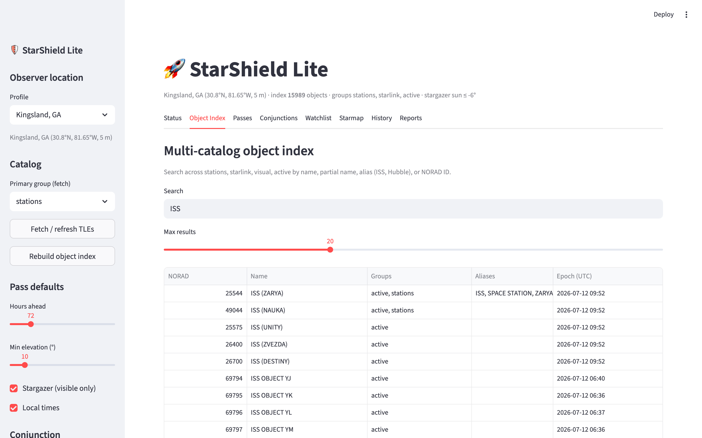

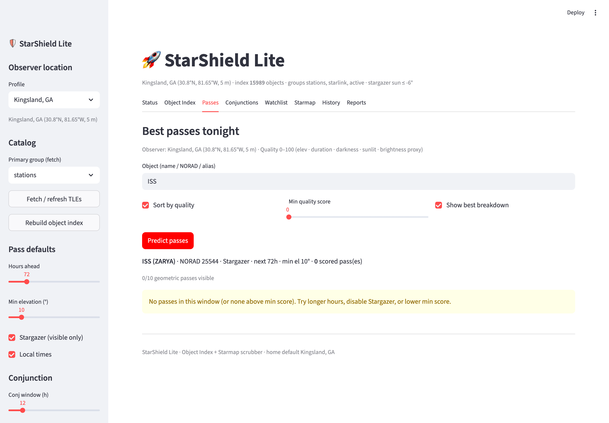

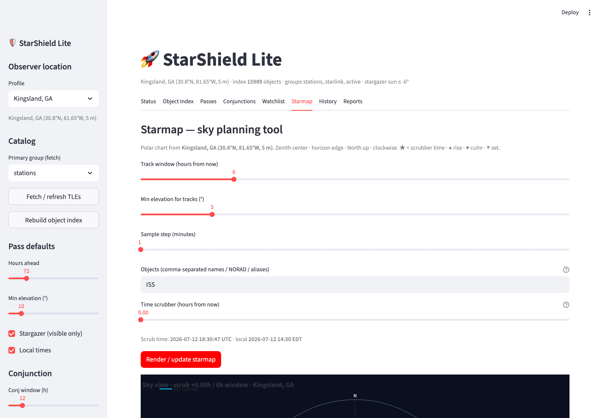

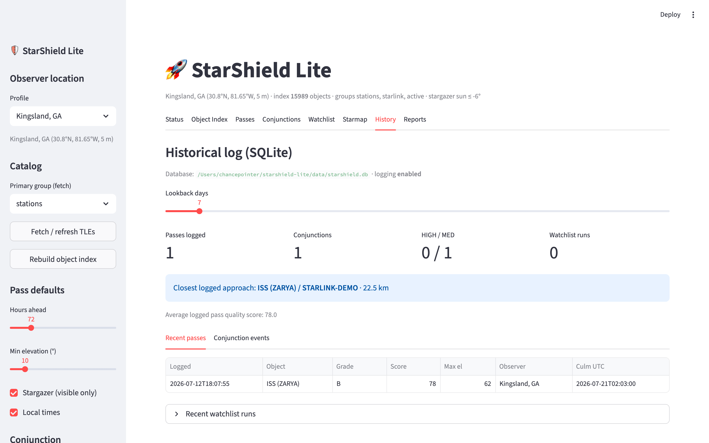

### FastAPI

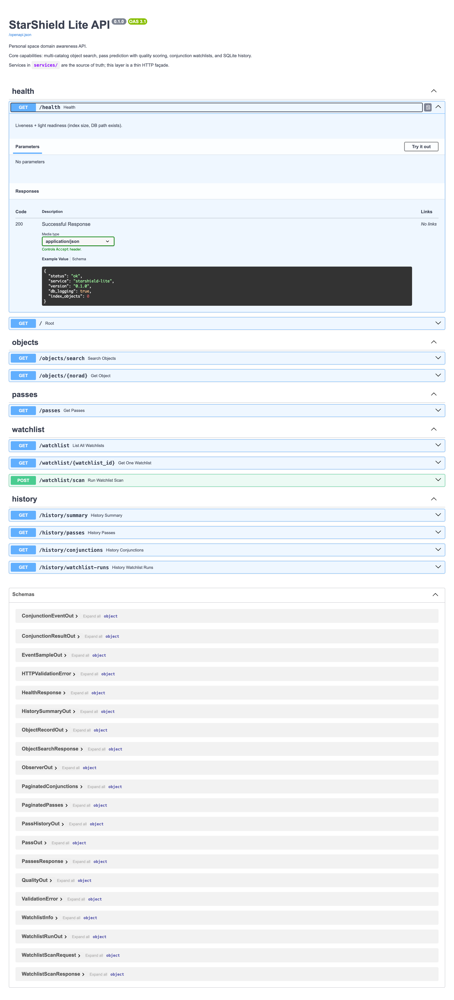

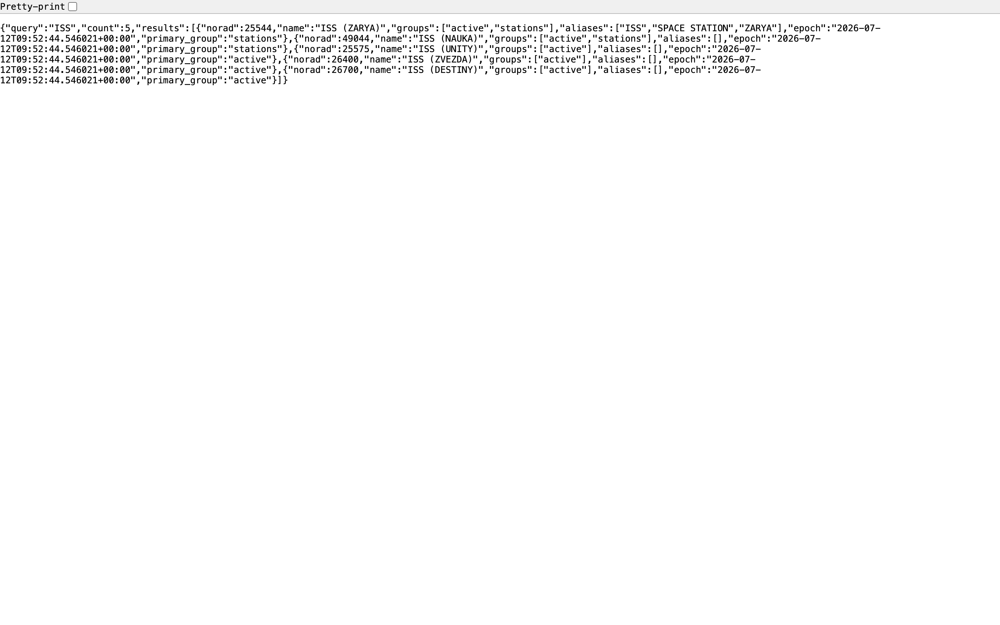

### CLI & reports

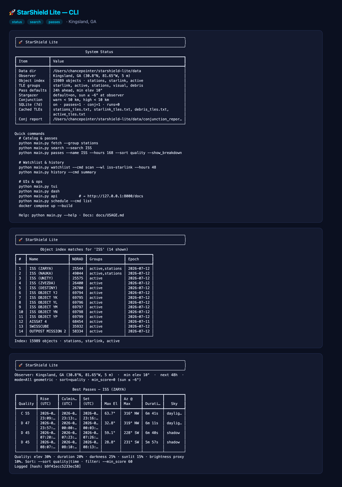

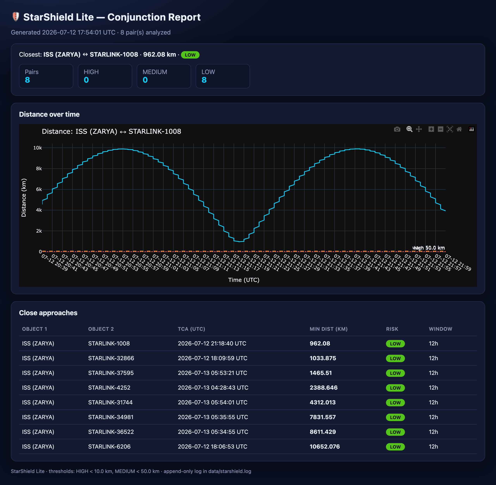

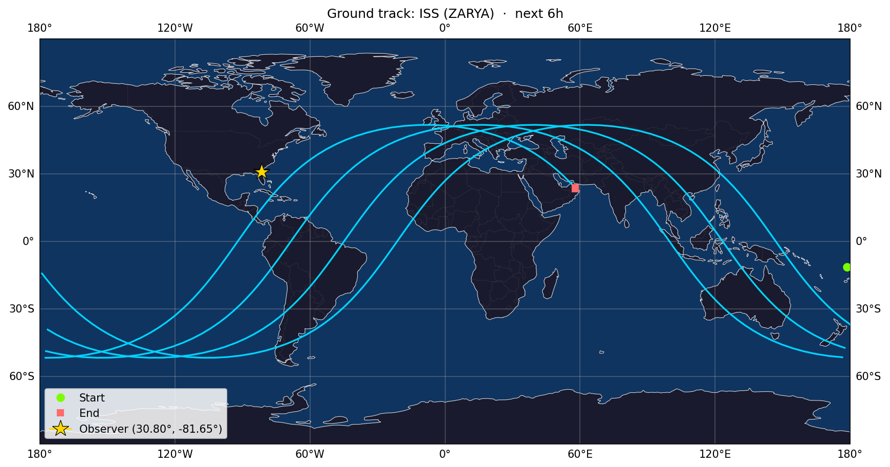

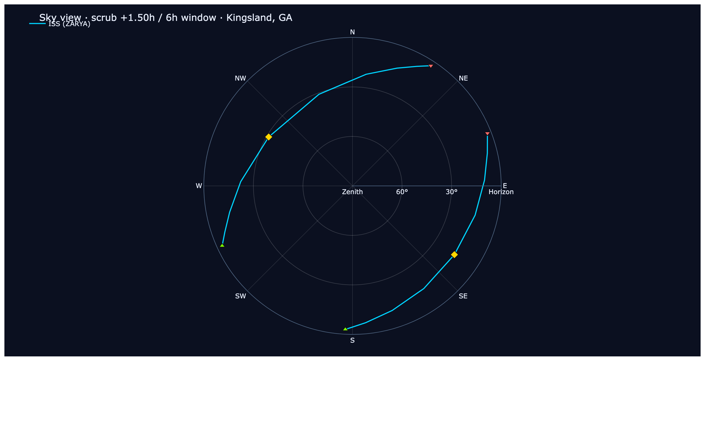

More images live in [`docs/screenshots/`](docs/screenshots/).

---

## Installation (detailed)

### Docker

See [Quick Start · Path 1](#path-1--docker-recommended). Copy [`.env.example`](.env.example) → `.env` before `docker compose` if you want custom ports, webhooks, or API keys (everything remains optional).

```bash
docker compose up --build                      # API only → :8000/docs
docker compose --profile full up --build       # API + Streamlit + scheduler
docker compose --profile ui up --build         # API + Streamlit
docker compose --profile jobs up --build       # API + scheduler
```

| Check | Command |
|-------|---------|
| Health | `curl -s http://localhost:8000/health \| jq` |
| Search | `curl -s 'http://localhost:8000/objects/search?q=ISS&limit=5' \| jq` |
| Fetch TLEs | `docker compose exec api python main.py fetch --group stations` |
| Stop | `docker compose --profile full down` |

Persistent state: **`./data`** (gitignored). Full guide: [docs/DOCKER.md](docs/DOCKER.md).

---

### Local Python

See [Quick Start · Path 2](#path-2--local-python--guided-demo). Optional extras:

| Extra | Install | Provides |
|-------|---------|----------|
| `pdf` | `pip install -e ".[pdf]"` | PDF export (`fpdf2`) |
| `maps` | `pip install -e ".[maps]"` | Cartopy ground-track PNGs |
| `dev` | `pip install -e ".[dev]"` | pytest, ruff |
| `full` | `pip install -e ".[full]"` | pdf + maps + dev |

```bash
make fetch                 # stations + starlink TLEs
# or: starshield fetch --group stations
```

Also available: `pip install -r requirements.txt` (full stack) or `requirements-docker.txt` (lean API).

---

## Ways to run

### Interfaces at a glance

| Interface | Command | Best for |
|-----------|---------|----------|
| **CLI** | `python main.py <action>` | Scripts, quick checks |
| **TUI** | `python main.py tui` | Keyboard-driven terminal use |
| **Streamlit** | `python main.py dash` | Maps, starmap, interactive tables |
| **API** | `python main.py api` | Integration, OpenAPI, clients |
| **Scheduler** | `python main.py schedule --cmd start` | Unattended watchlist scans |
| **Docker** | `docker compose up` | Reproducible demos and local deploys |
| **Guided demo** | `make demo` / `python demo/demo.py` | End-to-end feature walkthrough |

### Common CLI commands

```bash
python main.py --help
python main.py status
python main.py search --search ISS
python main.py passes --name ISS --hours 168 --sort quality --show_breakdown
python main.py watchlist --cmd scan --wl iss-starlink --hours 48
python main.py history --cmd summary
python main.py api                 # → http://127.0.0.1:8000/docs
python main.py dash                # Streamlit
python main.py tui                 # Textual TUI
```

---

## Example workflows

### 1. Find the best visible passes tonight

```bash
python main.py fetch --group stations
python main.py passes --name ISS --hours 72 --sort quality --show_breakdown
# Or geometric ranking when no stargazer windows exist:
python main.py passes --name ISS --hours 336 --stargazer=False --sort quality --min_score 50
```

In Streamlit: **Passes** tab → object `ISS` → Sort by quality → Predict.

### 2. Monitor ISS–Starlink conjunction risk

```bash
python main.py fetch --group starlink
python main.py watchlist --cmd scan --wl iss-starlink --hours 48
python main.py history --cmd conj --object ISS --days 30
```

Schedule every 12 hours:

```bash
python main.py schedule --cmd start
# Docker: docker compose --profile jobs up -d
```

### 3. Plan the sky from another site

```bash
python main.py passes --name ISS --observer "Cherry Springs, PA" --hours 48
python main.py passes --name ISS --lat 30.67 --lon -81.46   # Amelia Island
```

Streamlit: sidebar **Observer location** → Starmap tab → time scrubber.

### 4. Call the API

```bash
python main.py api
curl -s 'http://127.0.0.1:8000/objects/search?q=ISS&limit=5' | jq
curl -s 'http://127.0.0.1:8000/passes?object=ISS&hours=48&stargazer=false&sort=quality' | jq
```

---

## Architecture

```
┌─────────────┐  ┌─────────────┐  ┌──────────────┐  ┌────────────┐
│  CLI/TUI    │  │  Streamlit  │  │   FastAPI    │  │ Scheduler  │
└──────┬──────┘  └──────┬──────┘  └──────┬───────┘  └─────┬──────┘
       │                │                │                │
       └────────────────┴───────┬────────┴────────────────┘
                                ▼
                    ┌───────────────────────┐
                    │   services/ (core)    │
                    │  object_index · sky   │
                    │  pass_quality · wl    │
                    │  database · scheduler │
                    └───────────┬───────────┘
                                ▼
                    ┌───────────────────────┐
                    │  core/  (Skyfield)    │
                    │  data/  (SQLite,TLE)  │
                    └───────────────────────┘
```

- **`services/`** — business logic (source of truth)  
- **`core/`** — orbital math, TLE fetch, simulation, plots  
- **`api/`** — thin HTTP façade over services  
- **`data/`** — TLEs, SQLite DB, watchlists, schedules, logs  

Full write-up: [docs/ARCHITECTURE.md](docs/ARCHITECTURE.md)

---

## Configuration

Copy [`.env.example`](.env.example) → `.env` for local or Docker Compose runs. All
variables are optional; defaults are fine for a first demo.

| Variable | Default | Meaning |
|----------|---------|---------|
| `STARSHIELD_DB_LOG` | `1` | Log B+ passes & MEDIUM/HIGH conjs to SQLite |
| `STARSHIELD_API_HOST` | `127.0.0.1` | API bind host (`0.0.0.0` in Docker) |
| `STARSHIELD_API_PORT` | `8000` | API port |
| `STARSHIELD_API_URL` | `http://…:8000` | Base URL for Streamlit API mode |
| `STARSHIELD_USE_API` | `0` | Streamlit uses HTTP API when reachable |
| `STARSHIELD_SCHEDULE_ENABLED` | `1` | Allow scheduler jobs |
| `STARSHIELD_API_RATE_LIMIT` | `1` | Enable per-IP rate limits (`0` to disable) |
| `STARSHIELD_API_RATE_LIMIT_PUBLIC` | `120/minute` | `/health`, `/objects/*`, list watchlists |
| `STARSHIELD_API_RATE_LIMIT_DEFAULT` | `60/minute` | `/history/*` and other default routes |
| `STARSHIELD_API_RATE_LIMIT_HEAVY` | `20/minute` | `/passes`, `/watchlist/*/scan`, `/export/*` |
| `STARSHIELD_API_KEY_REQUIRED` | `0` | Require `X-API-Key` on protected routes |
| `STARSHIELD_NOTIFY_ENABLED` | `1` | Global webhook notifications switch |
| `STARSHIELD_WEBHOOK_URL` | _(empty)_ | One or more comma-separated webhook URLs |
| `STARSHIELD_NOTIFY_PASS_MIN_SCORE` | `70` | Min pass quality score to notify (≈ Grade B) |
| `STARSHIELD_NOTIFY_CONJ_RISKS` | `HIGH,MEDIUM` | Conjunction risk levels that fire webhooks |
| `STARSHIELD_INDEX_DEBRIS` | `auto` | Index debris groups only when TLE caches exist (`1` force · `0` never) |

**Practical notes**

- **Debris index** (`STARSHIELD_INDEX_DEBRIS=auto`) — debris catalogs do not download themselves; after `debris --cmd fetch`, they join search automatically.
- **Rate limits** — three buckets protect heavy routes; set `STARSHIELD_API_RATE_LIMIT=0` for unrestricted local scripting.
- **Risk bands** — MEDIUM &lt; 50 km, HIGH &lt; 10 km by default (`CONJ_THRESHOLD_KM` / `CONJ_HIGH_RISK_KM` in `config.py`).
- More recipes: [docs/USAGE.md](docs/USAGE.md#advanced-configuration-notes).

### Debris (optional)

```bash
# Fetch a debris catalog (Cosmos-2251 alias)
starshield debris --cmd fetch --group debris
# Other catalogs: fengyun-1c-debris · iridium-33-debris

# Conjunction scan: ISS vs debris sample
starshield debris --cmd scan --name ISS --group debris --hours 24
# Or via watchlist (notifications + DB + PDF export apply)
starshield watchlist --cmd scan --wl iss-debris --hours 24

# Scheduler job (disabled by default): enable in data/schedules.json
# id: iss-debris-24h
```

### Webhooks (optional)

```bash
export STARSHIELD_WEBHOOK_URL=https://your.webhook/endpoint
starshield notify --cmd test          # or: python main.py notify --cmd test
starshield notify --cmd list
# Or edit data/notifications.json (format: generic | discord | slack)
```

Scheduled watchlist jobs and pass predictions automatically post when thresholds match.

Observer profiles are defined in `config.py` (`OBSERVER_PROFILES`). Risk bands: **HIGH** &lt; 10 km, **MEDIUM** &lt; 50 km.

---

## Project structure

```
starshield-lite/
├── pyproject.toml          # Package metadata + console scripts
├── main.py                 # CLI entry (Fire) → starshield
├── starshield_dash.py      # Streamlit launcher → starshield-dash
├── dashboard.py            # Streamlit UI
├── tui.py                  # Textual TUI → starshield-tui
├── config.py               # Paths, profiles, env config
├── api/                    # FastAPI app, rate limit, routers
├── services/               # Shared business logic (source of truth)
│   └── notifications.py    # Optional webhook alerts
├── core/                   # Propagation, prediction, sim, maps
├── utils/                  # Immutable log, alerts stub
├── demo/                   # Guided demo: demo.py + demo.md
├── examples/               # Extra scripts
├── data/                   # Runtime: TLEs, starshield.db, logs (gitignored)
├── docs/                   # Architecture, Docker, usage, screenshots
├── tests/                  # pytest suite
├── Makefile                # make demo · make docker-full · make test
├── CONTRIBUTING.md
├── Dockerfile
└── docker-compose.yml
```

---

## Documentation

| Doc | Contents |
|-----|----------|
| [CHANGELOG.md](CHANGELOG.md) | Release history (Keep a Changelog) |
| [docs/ARCHITECTURE.md](docs/ARCHITECTURE.md) | Layers, data flow, design choices |
| [docs/DOCKER.md](docs/DOCKER.md) | Compose profiles, volumes, troubleshooting |
| [docs/USAGE.md](docs/USAGE.md) | Common CLI/API recipes |
| [CONTRIBUTING.md](CONTRIBUTING.md) | Dev setup, tests, PR guidelines |
| [demo/demo.md](demo/demo.md) | Guided demo walkthrough and common commands |
| [demo/demo.py](demo/demo.py) | Interactive demo script |
| [examples/](examples/) | Programmatic API / watchlist / export samples |
| [Makefile](Makefile) | `make demo`, `make docker-full`, `make test`, … |

---

## Continuous integration

GitHub Actions runs on every **push** and **pull request** to `main` / `master`.  
Workflow: [`.github/workflows/ci.yml`](.github/workflows/ci.yml)

| Job | What it does |
|-----|----------------|
| **Lint** | Ruff check + format |
| **Test** | `pytest` on Python **3.11** and **3.12** |
| **Docker** | Multi-stage image build + `/health` smoke test |

---

## Development

```bash
pip install -e ".[pdf,dev]"
make test                  # pytest
make lint                  # ruff
make demo-auto             # non-interactive demo
make help                  # all targets
```

Full contributor guide (setup, Docker, PR workflow, style): **[CONTRIBUTING.md](CONTRIBUTING.md)**.  
Business logic lives in `services/`; keep UIs and the API as thin adapters.

---

## License

MIT — free to use and adapt.

## Release

Tagged releases follow [semantic versioning](https://semver.org/). Latest: **[v0.2.0](CHANGELOG.md)**.

---

## Acknowledgments

- [Skyfield](https://rhodesmill.org/skyfield/) & SGP4 for orbital propagation  
- [CelesTrak](https://celestrak.org/) for public GP element sets  
- FastAPI, Streamlit, Textual, Plotly, APScheduler  

---

StarShield Lite is an educational / personal SSA toolkit for exploring orbital mechanics, multi-interface UX, persistence, REST APIs, containers, and scheduled ops. It is **not** certified space-traffic management software.
